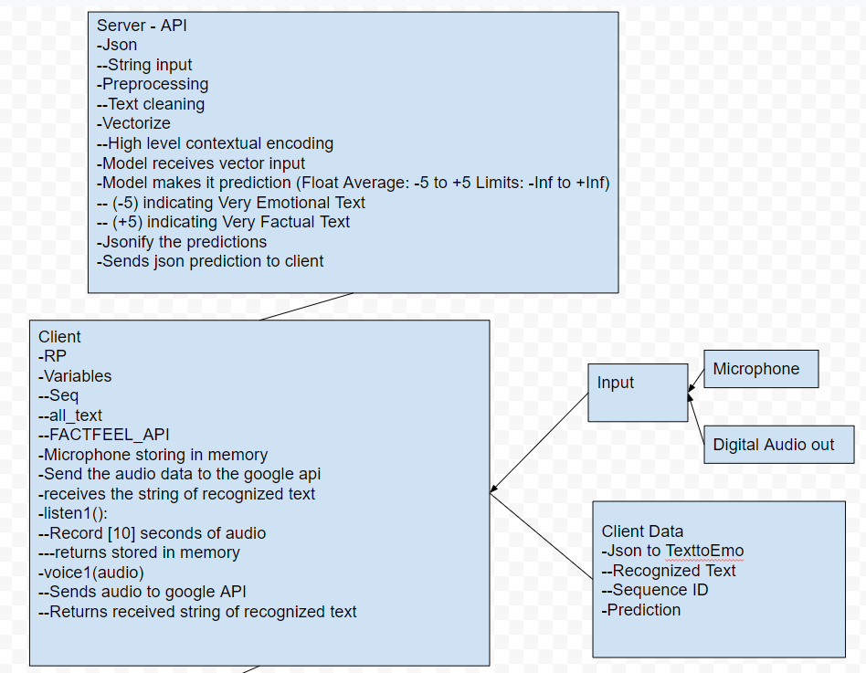
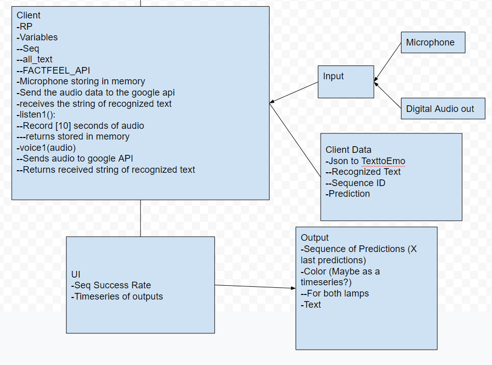

# Fact-Feel-FlaskApp
Flask App for model serving of NLP model determining the level of Factual or Feeling language used within a piece of text.

## Client - Server UML

## Client - UI UML

# Hardware
7" Touch Screen
![Touch Screen](https://www.adafruit.com/product/2718

# Questions:

